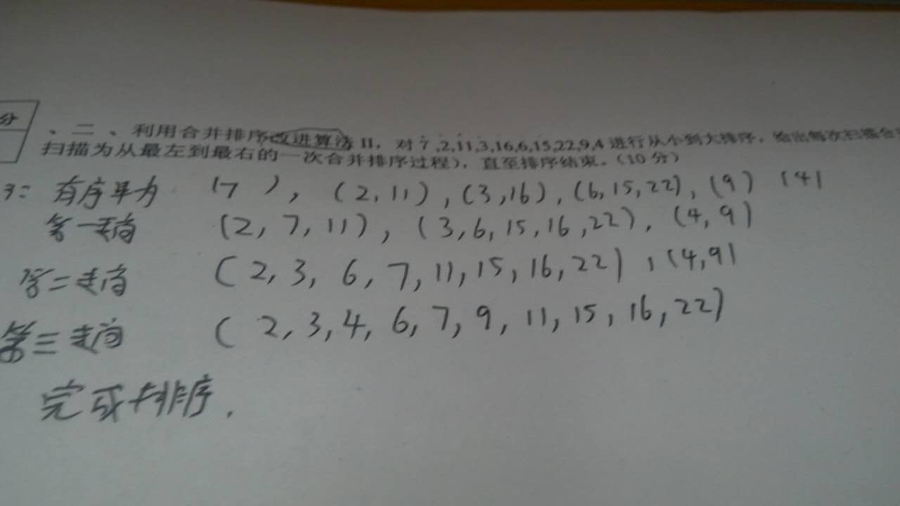

# 2016


<figure><figcaption></figcaption></figure>

<figure><figcaption></figcaption></figure>

<figure><figcaption></figcaption></figure>

<figure><figcaption></figcaption></figure>

<figure><figcaption></figcaption></figure>

<figure><figcaption></figcaption></figure>

```
def has_consecutive_zeros(s, left, right):
    # 基本情况：如果当前子串长度小于2，则不可能有连续的0
    if right - left < 2:
        return False

    # 递归情况：将问题分成两部分
    mid = (left + right) // 2
    left_half = has_consecutive_zeros(s, left, mid)
    right_half = has_consecutive_zeros(s, mid, right)

    # 如果左半部分或右半部分有连续的0，则整个子串也有连续的0
    if left_half or right_half:
        return True

    # 检查两个子串的交界处是否有连续的0
    # 由于是二进制串，我们只需要检查中间两个字符是否都是'0'
    return s[mid-1] == '0' and s[mid] == '0'
```

<figure><figcaption></figcaption></figure>

<figure><figcaption></figcaption></figure>

<figure><figcaption></figcaption></figure>
