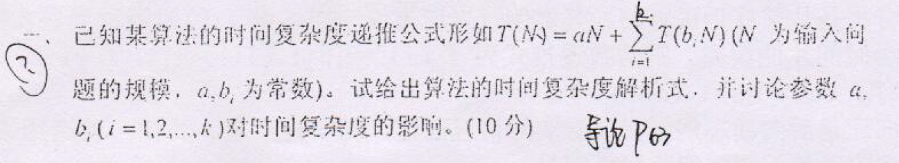

# 2009

## 第一题

<figure><figcaption></figcaption></figure>

<figure><figcaption></figcaption></figure>

<figure><figcaption></figcaption></figure>

## 第二题

根据所学，图示P、NP、P、NP、NP-C的关系（10）

<figure><figcaption></figcaption></figure>

## 第三题

<figure><figcaption></figcaption></figure>

<figure><figcaption></figcaption></figure>

## 第四题

<figure><figcaption></figcaption></figure>

<figure><figcaption></figcaption></figure>

<figure><figcaption></figcaption></figure>

## 第五题

<figure><figcaption></figcaption></figure>

<figure><figcaption></figcaption></figure>

